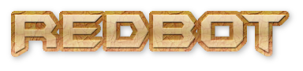

<a name="readme-top"></a>

<!-- PROJECT SHIELDS -->
[![Contributors][contributors-shield]][contributors-url]
[![Forks][forks-shield]][forks-url]
[![Stargazers][stars-shield]][stars-url]
[![Issues][issues-shield]][issues-url]
[![MIT License][license-shield]][license-url]
[![LinkedIn][linkedin-shield]][linkedin-url]


<!-- PROJECT LOGO -->
<br />
<div align="center">
  <a href="https://github.com/coderaman7/redbot">
    
  </a>

<h3 align="center">RedBot</h3>

  <p align="center">
    A Cross Platform Desktop Application which enables a Reddit user to automate NSFW gifs posting from Redgifs directly from Desktop wihtout opening redgifs or reddit on multiple Sub Reddits and also it enables a user to promote a particular Sub Reddits.
    <br />
    <a href="https://github.com/coderaman7/redbot"><strong>Explore the docs »</strong></a>
    <br />
    <br />
    <a href="https://github.com/coderaman7/redbot">View Demo</a>
    ·
    <a href="https://github.com/coderaman7/redbot/issues">Report Bug</a>
    ·
    <a href="https://github.com/coderaman7/redbot/issues">Request Feature</a>
  </p>
</div>


<!-- TABLE OF CONTENTS -->
<details>
  <summary>Table of Contents</summary>
  <ol>
    <li>
      <a href="#about-the-project">About The Project</a>
      <ul>
        <li><a href="#built-with">Built With</a></li>
      </ul>
    </li>
    <li>
      <a href="#getting-started">Getting Started</a>
      <ul>
        <li><a href="#prerequisites">Prerequisites</a></li>
        <li><a href="#installation">Installation</a></li>
      </ul>
    </li>
    <li><a href="#usage">Usage</a></li>
    <li><a href="#roadmap">Roadmap</a></li>
    <li><a href="#contributing">Contributing</a></li>
    <li><a href="#license">License</a></li>
    <li><a href="#contact">Contact</a></li>
    <li><a href="#acknowledgments">Acknowledgments</a></li>
  </ol>
</details>


<!-- ABOUT THE PROJECT -->
## About The Project

[![Product Name Screen Shot][product-screenshot]](https://github.com/coderaman7/redbot)
[![Product Name Screen Shot][product-screenshot2]](https://github.com/coderaman7/redbot)

<p align="right">(<a href="#readme-top">back to top</a>)</p>


### Built With

* [![Python][Python]][Python-url]
* [![Tkinter][Tkinter]][Tkinter-url]
* [![PRAW][PRAW]][PRAW-url]
* [![JSON][JSON]][JSON-url]

<p align="right">(<a href="#readme-top">back to top</a>)</p>


<!-- GETTING STARTED -->
## Getting Started

This is an example of how you may give instructions on setting up your project locally.
To get a local copy up and running follow these simple example steps.

### Prerequisites

This is an example of how to list things you need to use the software and how to install them.
* python3
* pip

### Installation

1. Get your Reddit API Key at [https://www.reddit.com/prefs/apps/](https://www.reddit.com/prefs/apps/)
2. Clone the repo
   ```sh
   git clone https://github.com/coderaman7/redbot.git
   ```
3. Install NPM packages
   ```sh
   pip install -r requirements.txt
   ```
<p align="right">(<a href="#readme-top">back to top</a>)</p>


<!-- USAGE EXAMPLES -->
## Usage

This project is used to automate Reddit and Redgifs so that you can grow up your personal NSFW Subreddit without even creating your NSFW content as sharing Redgifs VODs to Reddit is a general practice which is not termed as illegal ( unless you're taking the copyrights of the VODs you're sharing and generating somekind of income by selling someone else VODs ).

<!-- _For more examples, please refer to the [Documentation](https://example.com)_ -->

<p align="right">(<a href="#readme-top">back to top</a>)</p>


<!-- ROADMAP -->
## Roadmap

- [x] Get a Random NSFW Gifs from Redgifs ( Termed in this as Automate )
- [x] Mine a Video/VOD
  - [x] Get a Particular Gif from Redgifs based on cateogary
  - [x] Get a Particular Gif/Photo from a selected Subreddit
  - [x] Post a Particular URL
  - [x] Post Multiple Images on Reddit without even opening a single browser
  - [x] Post Text to Multiple Sub reddits
  - [x] Post from Saved Vids/Posts
- [x] Delete your Post or Comments based on a set amount of Likes/Karma
    - [x] This set amount can be changable
- [x] Download Saved Vids from Reddit
- [x] Post on Subreddites posted last time

See the [open issues](https://github.com/coderaman7/redbot/issues) for a full list of proposed features (and known issues).

<p align="right">(<a href="#readme-top">back to top</a>)</p>


<!-- CONTRIBUTING -->
## Contributing

Contributions are what make the open source community such an amazing place to learn, inspire, and create. Any contributions you make are **greatly appreciated**.

If you have a suggestion that would make this better, please fork the repo and create a pull request. You can also simply open an issue with the tag "enhancement".
Don't forget to give the project a star! Thanks again!

1. Fork the Project
2. Create your Feature Branch (`git checkout -b feature/AmazingFeature`)
3. Commit your Changes (`git commit -m 'Add some AmazingFeature'`)
4. Push to the Branch (`git push origin feature/AmazingFeature`)
5. Open a Pull Request

<p align="right">(<a href="#readme-top">back to top</a>)</p>


<!-- LICENSE -->
## License

Distributed under the MIT License. See `LICENSE` for more information.

<p align="right">(<a href="#readme-top">back to top</a>)</p>


<!-- CONTACT -->
## Contact

Name - Aman
Twitter - [@coderaman7](https://twitter.com/coderaman7)  
Email - bugsoverflow@gmail.com  
Website Connect - https://codeitdown.vercel.app/contact

Project Link: [https://github.com/coderaman7/redbot](https://github.com/coderaman7/redbot)

<p align="right">(<a href="#readme-top">back to top</a>)</p>


<!-- MARKDOWN LINKS & IMAGES -->
<!-- https://www.markdownguide.org/basic-syntax/#reference-style-links -->
[contributors-shield]: https://img.shields.io/github/contributors/coderaman7/redbot.svg?style=for-the-badge
[contributors-url]: https://github.com/coderaman7/redbot/graphs/contributors
[forks-shield]: https://img.shields.io/github/forks/coderaman7/redbot.svg?style=for-the-badge
[forks-url]: https://github.com/coderaman7/redbot/network/members
[stars-shield]: https://img.shields.io/github/stars/coderaman7/redbot.svg?style=for-the-badge
[stars-url]: https://github.com/coderaman7/redbot/stargazers
[issues-shield]: https://img.shields.io/github/issues/coderaman7/redbot.svg?style=for-the-badge
[issues-url]: https://github.com/coderaman7/redbot/issues
[license-shield]: https://img.shields.io/github/license/coderaman7/redbot.svg?style=for-the-badge
[license-url]: https://github.com/coderaman7/redbot/blob/master/LICENSE
[linkedin-shield]: https://img.shields.io/badge/-LinkedIn-black.svg?style=for-the-badge&logo=linkedin&colorB=555
[linkedin-url]: https://linkedin.com/in/coderaman7


[product-screenshot]: assets/screen.png
[product-screenshot2]: assets/screen1.png


[Python]: https://img.shields.io/badge/python-000000?style=for-the-badge&logo=python&logoColor=white
[Python-url]: https://python.org/
[Tkinter]: https://img.shields.io/badge/Tkinter-20232A?style=for-the-badge&logo=tkinter&logoColor=61DAFB
[Tkinter-url]: https://docs.python.org/3/library/tkinter.html
[PRAW]: https://img.shields.io/badge/PRAW-35495E?style=for-the-badge&logo=praw&logoColor=4FC08D
[PRAW-url]: https://praw.readthedocs.io/en/stable/
[JSON]: https://img.shields.io/badge/JSON-DD0031?style=for-the-badge&logo=json&logoColor=white
[JSON-url]: https://www.w3schools.com/js/js_json_intro.asp